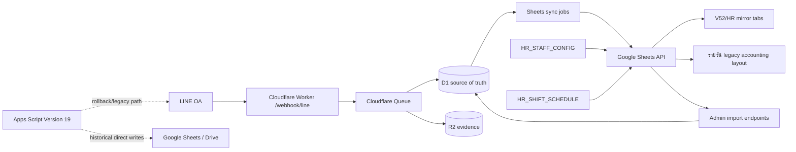

# MalisPang Board — Google Sheets & Legacy Apps Script Dependency Inventory

Status: Phase 0 audit for #46 and Legacy shutdown gate #58  
Scope: repository `Eak-dev/malipang-shop` current `main` plus owner-confirmed Legacy Apps Script Web App **Version 19** evidence.

> This document is an inventory only. It does not authorize a Production deploy, Runtime Mode change, LINE Webhook change, Secret change, Google Sheets sync shutdown, or Legacy Apps Script shutdown.

## Executive summary

The Worker/D1 backend already owns the operational processing for Attendance, Payroll and Expense, but Google Sheets is **not yet removable**. It currently has three distinct roles:

1. **Input/config source** — `HR_STAFF_CONFIG` and `HR_SHIFT_SCHEDULE` are imported into D1.
2. **Operational mirror/report sink** — Attendance, daily/weekly Payroll, wage history, shift schedule, OT and Expense are synchronized from D1 to Sheets.
3. **Legacy accounting layout** — confirmed Expenses are also written into the existing `รายวัน` sheet layout using its month blocks, payment columns and existing formulas/report structure.

In addition, `/admin/readiness` currently treats Google Sheets metadata and the `รายวัน` layout as a required readiness dependency. Therefore setting `SHEETS_SYNC_ENABLED=false` would stop sync-job writes, but would **not** remove all Google Sheets reads or readiness dependency.

Legacy Apps Script Version 19 is a separate concern from Direct Sheets API. Owner evidence confirms an active Version-19 Web App deployment. Uploaded Version-19 source shows `doPost()` routes LINE text/image/postback flows and `MPSYS_cleanupExpiredImages` is installed as a daily time-driven cleanup job. The cleanup responsibility is not yet fully replaced in Worker/R2; tracked by #74.

## Current data flow

## Repository dependency inventory

| Sheet / dependency | Read / Write | Code path | Business purpose | Headers / formulas / layout | D1 replacement | Cutover readiness | Risk |
|---|---|---|---|---|---|---|---|
| Google Spreadsheet metadata | Read | `src/sheets/client.ts:getSpreadsheetMetadata`, `src/admin/readiness.ts` | Readiness verifies spreadsheet is reachable | Spreadsheet ID/title/time zone | No replacement needed for core runtime, but readiness must be redesigned before Sheets removal | **BLOCKED** | High: `/admin/readiness` fails if Sheets is unavailable |
| `HR_STAFF_CONFIG` | Read | `src/admin/staff-import.ts:importEmployeesFromConfiguredSheet` | Employee identity, LINE binding, shift defaults, wage, grace/deduction flags, expense permission | Required: `Employee_ID`, `Staff_Name`, `LINE_User_ID`, `Scheduled_In`, `Scheduled_Out`, `Status`, `Daily_Wage`, `Grace_Min`; optional wage effective date and deduction/permission fields | `employees` + `employee_wage_history` in D1 after import | **BLOCKED** until Owner/Board can manage config directly in D1 with audit/versioning | High: staff/wage changes still originate from Sheet in this flow |
| `V52_ATTENDANCE_RAW` | Write | `src/sheets/sync.ts` via `ATTENDANCE_EVENT` | Operational/report mirror of accepted Attendance events | Header bootstrapped in `src/sheets/client.ts` | `attendance_events` in D1 is authoritative | Ready for read-only Board; not ready to disable mirror until parity observation passes | Medium |
| `V52_DAILY_PAYROLL` | Write | `src/sheets/sync.ts` via `DAILY_PAYROLL` | Daily Payroll mirror | Header bootstrapped in `src/sheets/client.ts` | `attendance_daily` in D1 is authoritative | Ready for Board read from D1; keep sync during parity window | Medium |
| `V52_WEEKLY_PAYROLL` | Write | `src/sheets/sync.ts` via `WEEKLY_PAYROLL` | Weekly Payroll mirror | `Pay_Date`, `Period_Start`, ..., `Period_End`; final cycle Thursday–Wednesday | `payroll_weekly` in D1 is authoritative | Logic corrected by #44/#69/#72; still requires operational parity evidence | High until observation #61 passes |
| `HR_WAGE_HISTORY` | Write | `src/sheets/sync.ts` via `WAGE_HISTORY`; jobs created by staff/payroll admin paths | Wage audit/report mirror | Header bootstrapped in `src/sheets/client.ts` | `employee_wage_history` in D1 | D1 authoritative after explicit effective-date updates | Medium |
| `HR_SHIFT_SCHEDULE` | **Read + Write** | Read: `src/admin/shift-import.ts`; Write: `src/sheets/sync.ts` via `SHIFT_SCHEDULE` | Shift planning input and mirror | Import requires `Work_Date`, `Employee_ID`, `Status`; optional schedule/note values | `employee_shift_days` in D1 after import | **BLOCKED** until shift editing/source-of-truth moves off Sheets | High: bidirectional dependency |
| `HR_OT_REQUESTS` | Write | `src/sheets/sync.ts` via `OT_REQUEST` | Fixed OT request/finalization mirror | Header bootstrapped in `src/sheets/client.ts` | `ot_requests` in D1 | D1 operational source; mirror still needed during parity period | Medium |
| `V52_EXPENSE_RAW` | Write | `src/sheets/sync.ts` via `EXPENSE` | Expense event mirror | Header bootstrapped in `src/sheets/client.ts` | `expense_events` + `expense_documents` in D1 | Core Expense can operate in D1, but accounting mirror/`รายวัน` remains required | High |
| `รายวัน` | **Read + Write + clear selected inputs** | `src/sheets/daily-expense.ts`, called from `src/sheets/sync.ts` for confirmed/cancelled Expense; readiness validates layout | Existing owner accounting/report sheet | Reads `A1:D1000` and `A1:W3`; detects month blocks and payment columns. Writes B:D, selected payment amount column, V:W. Clears B:D, F:H, K:Q, V:W for mapped row; deliberately leaves other columns/formula areas untouched | **No full D1/report replacement yet** | **BLOCKED** | Critical: current accounting output depends on existing layout and formula/report behavior |
| `V52_SYSTEM_LOG` | Header/bootstrap configuration | `src/sheets/client.ts` definition; `Env` includes `SHEET_SYSTEM_LOG` | Intended system log tab | Header: `Created_At`, `Trace_ID`, `Level`, `Event`, `Detail` | D1 `metrics`, `failed_jobs`, audit/status data cover most runtime observability | Review/remove later; current `syncJob()` has no `SYSTEM_LOG` writer branch | Low/cleanup item |
| Google OAuth service account | Auth dependency | `src/sheets/google-auth.ts` | Auth for Direct Google Sheets API | `GOOGLE_SERVICE_ACCOUNT_EMAIL`, `GOOGLE_PRIVATE_KEY_BASE64`, `GOOGLE_SPREADSHEET_ID` | Not needed after all Sheets dependencies are removed | **BLOCKED** | Secret must remain while any Direct Sheets API read/write exists |
| `SHEETS_SYNC_ENABLED` | Runtime gate for sync jobs | `src/sheets/sync.ts`, `src/db/repositories.ts:enqueueSheetSyncBatch` | Stops D1→Sheets sync processing when false | Does **not** disable imports, bootstrap or readiness Sheets probes; new sync jobs are not persisted while disabled | N/A | Not a complete cutover switch | High if mistaken as "no Sheets dependency" or as an automatically catch-up-able pause |
| Sheet bootstrap | Read + Write | `/admin/bootstrap-sheets` → `src/sheets/client.ts:bootstrapSheets` | Creates mirror tabs and rewrites required header rows | Adds missing tabs and writes headers to A1:* | Board/D1 does not need this after final Sheets retirement | Keep during current release/parity phase | Medium |
| Reconcile | D1 → queue → Sheets write | `/admin/reconcile-sheets` → `src/admin/reconcile-sheets.ts` | Rebuilds mirror jobs from D1 | Attendance, daily/weekly Payroll, wage, shift, OT, confirmed Expense | D1 remains source; reconcile is migration/parity tooling | Required during #61 observation and for any controlled sync-disable rollback/backfill | Medium |
| Retry/recovery | D1 → queue → Sheets write | `/admin/retry-sync`, scheduled recovery, `recoverPendingSheetJobs` | Recover failed/stale Sheets sync | Uses `sync_jobs` status/lease/retry model | Not needed after mirror retirement | Required while Sheets sync remains enabled; cannot recover jobs that were never created while sync was disabled | Medium |

## Environment / configuration references

Current repository configuration includes:

- `SHEETS_SYNC_ENABLED=true`
- `SHEET_STAFF_CONFIG=HR_STAFF_CONFIG`
- `SHEET_ATTENDANCE_RAW=V52_ATTENDANCE_RAW`
- `SHEET_DAILY_PAYROLL=V52_DAILY_PAYROLL`
- `SHEET_WEEKLY_PAYROLL=V52_WEEKLY_PAYROLL`
- `SHEET_WAGE_HISTORY=HR_WAGE_HISTORY`
- `SHEET_SHIFT_SCHEDULE=HR_SHIFT_SCHEDULE`
- `SHEET_OT_REQUESTS=HR_OT_REQUESTS`
- `SHEET_EXPENSE_RAW=V52_EXPENSE_RAW`
- `SHEET_EXPENSE_DAILY=รายวัน`
- `SHEET_SYSTEM_LOG=V52_SYSTEM_LOG`

Sensitive credential **names only** required by current Direct Sheets API path:

- `GOOGLE_SERVICE_ACCOUNT_EMAIL`
- `GOOGLE_PRIVATE_KEY_BASE64`
- `GOOGLE_SPREADSHEET_ID`

Secret values, private keys and full external IDs must never be copied into Issues or this document.

## What happens if `SHEETS_SYNC_ENABLED=false` today

### Stops

Both `enqueueSheetSyncBatch()` and `syncJob()` short-circuit while the flag is false. That means the mirrors stop updating **and new sync jobs are not inserted/queued for transactions that occur during the disabled interval**:

- Attendance
- Daily Payroll
- Weekly Payroll
- Wage history
- Shift schedule mirror
- OT requests
- Expense raw
- `รายวัน` confirmed/cancelled Expense posting through the sync path

This is important operationally: turning sync back on does **not** automatically replay the disabled interval, because those missing jobs do not exist in `sync_jobs` for `/admin/retry-sync` to recover.

### Does not stop / does not remove dependency

- `/admin/import-employees-from-sheet` still reads `HR_STAFF_CONFIG`.
- `/admin/import-shifts-from-sheet` still reads `HR_SHIFT_SCHEDULE`.
- `/admin/bootstrap-sheets` still accesses and writes Google Sheets.
- `/admin/readiness` still probes spreadsheet metadata and validates the `รายวัน` layout, so readiness can fail when Sheets is unavailable.
- Google service-account configuration remains required by those paths.

### Required rollback/backfill after any controlled disable test

If an approved future test temporarily disables Sheets sync and then decides to re-enable it:

1. Record the exact disabled start/end timestamps and corresponding Bangkok business-date range.
2. Re-enable `SHEETS_SYNC_ENABLED` only through the approved change procedure.
3. Run a **date-bounded** `/admin/reconcile-sheets` for the entire disabled interval to recreate mirror jobs from D1.
4. Wait until pending/processing sync returns to zero and failed/DLQ gates are clean.
5. Compare D1 ↔ Sheets totals/rows for Attendance, Payroll and Expense before declaring rollback/catch-up complete.

`/admin/retry-sync` alone is insufficient for the disabled interval because it only operates on sync jobs that already exist.

Conclusion: **`SHEETS_SYNC_ENABLED=false` is not equivalent to "Google Sheets removed" and must not be treated as a lossless pause without an explicit reconcile backfill.**

## `รายวัน` formula/layout protection

`src/sheets/daily-expense.ts` treats the existing `รายวัน` tab as a structured legacy accounting layout rather than a generic table.

Current writer behavior:

1. Detect month blocks from existing sheet body.
2. Resolve cash/transfer/card payment columns from the existing headers and cutoff rows.
3. Reserve a specific row via D1 `sheet_row_index`.
4. Clear only designated input ranges: `B:D`, `F:H`, `K:Q`, `V:W`.
5. Write date/description, the selected payment amount cell, category and source wallet.
6. Leave other columns untouched so existing calculated/report columns can remain intact.

Before `รายวัน` can be retired, its formulas, monthly summaries, credit-card cutoff behavior and any downstream owner reports must be reproduced outside Google Sheets and validated against historical samples.

## Board scope source-of-truth check

| Board module | D1/R2 coverage | Sheets-only or Sheets-input dependency | Phase-1 read-only status |
|---|---|---|---|
| Attendance | D1 `attendance_events`, `attendance_daily`; R2 evidence | Staff config still imported from Sheet | Can read from D1/R2 |
| Payroll | D1 daily/weekly, wage history, OT | Staff/shift inputs still have Sheet flows | Can read from D1, subject to cycle/parity testing |
| Expense | D1 events/documents; R2 evidence | `รายวัน` accounting output still required | Can read from D1/R2; cannot retire Sheets accounting yet |
| Employee Config | D1 after import | `HR_STAFF_CONFIG` remains input source | Read-only Board can display D1; edit/source migration is later phase |
| System Status | D1/queue/R2/LINE available | Current readiness explicitly requires Sheets | Board can display status, but readiness contract must be split before Sheets retirement |

## Owner-confirmed Legacy Apps Script Version 19

Owner confirmed the currently active Legacy Web App baseline is **Version 19**.

Owner-provided Version-19 source/evidence establishes these legacy responsibilities:

- `doPost(e)` receives LINE webhook events and routes text, image and postback flows.
- Legacy Expense writes to `Logs`, `รายวัน` and system Expense sheets.
- Legacy Attendance reads staff config and writes HR attendance/raw records.
- `MPSYS_setupFullSystem()` creates/maintains hidden Expense system sheets and installs a cleanup trigger.
- `MPSYS_installCleanupTrigger_()` creates a daily time-driven trigger for `MPSYS_cleanupExpiredImages` around hour 02.
- `MPSYS_cleanupExpiredImages` expires pending image actions and removes old Drive evidence according to retention settings.

Do not copy Script ID, Deployment ID, Web App URL, Tokens or private source credentials into GitHub.

### Legacy → Worker replacement map

| Legacy responsibility | Worker/D1 replacement | Status |
|---|---|---|
| LINE webhook `doPost` ingress | `/webhook/line` + Queue + `processInbound` | Implemented; runtime/webhook parity still needs #59/#61 evidence |
| LINE dedup / redelivery protection | `inbound_events`, claim/lease logic, message/reference duplicate checks | Implemented; observation required |
| Attendance image validation | Vision + `validateAttendancePhoto` + Durable Object | Implemented; observation required |
| Attendance evidence in Drive | R2 `EVIDENCE` | Implemented storage/read path |
| Expense text/image handling | D1 Expense service + R2 + LINE Flex | Implemented; parity required |
| Payroll calculation | D1 daily/weekly Payroll | Implemented; Thursday–Wednesday fixes #44/#69/#72 |
| Google Sheet outputs | Direct Sheets API + queue/retry/reconcile | Implemented while Sheets remains enabled |
| Daily image retention cleanup | Worker/R2 retention replacement | **MISSING — #74 BLOCKER** |
| Legacy Web App / Trigger shutdown | Staged plan #58 → #59/#60/#46/#61/#65/#66 | Not yet authorized |

## Blockers before Board Phase 1 can treat D1 as complete read source

1. Resolve current runtime/source parity in #59 / runtime mismatch #67.
2. Keep final Payroll cycle regression fixes passing (#44, #69, #72).
3. Finish external Legacy Apps Script inventory/backup #60.
4. Implement/validate R2 evidence retention replacement #74.
5. Confirm all Board API queries use D1/R2 and do not depend on browser access to Sheets/Admin Token.

## Blockers before Google Sheets sync can be disabled

1. Replace `HR_STAFF_CONFIG` as an operational input source with audited D1/Board employee config.
2. Replace `HR_SHIFT_SCHEDULE` input workflow with audited D1/Board scheduling.
3. Replace `รายวัน` accounting/report output including card cutoff/month summary behavior.
4. Split `/admin/readiness` so Sheets is optional once Sheets is intentionally retired.
5. Remove/retire bootstrap, import, reconcile and retry paths that exist only for Sheets.
6. Run parallel parity/UAT and prove Lost = 0, Duplicate = 0 and explained totals.
7. Define a bounded disabled-interval reconcile/backfill procedure before any test of `SHEETS_SYNC_ENABLED=false`.
8. Only then remove Google service-account dependencies and retire the sync feature safely.

## Recommended migration order

1. **Current gate:** keep Direct Sheets API and Legacy Version 19 unchanged while #59/#60/#61 are being proven.
2. Build Board read-only from D1/R2; Google Sheets remains comparison output.
3. Move Employee Config editing/source of truth from `HR_STAFF_CONFIG` to D1 with audit history.
4. Move Shift Schedule editing/source of truth from Sheet to D1.
5. Build a replacement for the `รายวัน` accounting/report behaviors and validate historical totals.
6. Change readiness from mandatory Sheets probe to explicit optional integration health once approved.
7. Run a controlled period with Sheets writes disabled only after recording the exact interval and pre-authorizing the reconcile-backfill/rollback procedure.
8. If sync is re-enabled, run date-bounded `/admin/reconcile-sheets` over the full disabled interval and prove pending/processing/failed/DLQ/parity gates are clean.
9. Retire Google credentials/import/bootstrap/reconcile code only after parity and Owner approval.

## Unknowns / Owner evidence still required

- Confirm every Google account/project that can own the Version-19 cleanup trigger (#71).
- Complete a private export/backup of Version-19 source, trigger/deployment inventory and legacy sheets (#60).
- Confirm the exact Google spreadsheet/file that current `GOOGLE_SPREADSHEET_ID` points to without posting the ID publicly.
- Confirm every downstream report/formula/user workflow that consumes `รายวัน` beyond the repository code.
- Approve the Worker/R2 evidence retention policy before destructive Production cleanup is enabled (#74).

## Phase-0 conclusion

Google Sheets is currently a **secondary operational dependency**, not the source of truth for Attendance/Payroll/Expense calculations, but it is still required for staff/shift input workflows, accounting output and readiness. Legacy Apps Script Version 19 also retains an un-replaced cleanup responsibility.

Therefore:

- Building the read-only MalisPang Board from D1/R2 is viable.
- Closing Legacy Apps Script or Google Sheets dependencies today is **NO-GO**.
- The safe sequence remains #59 → #60/#46 → #74 as needed → #61 → #65 → #66, with Google Sheets retirement handled separately after its input/accounting dependencies are replaced.
