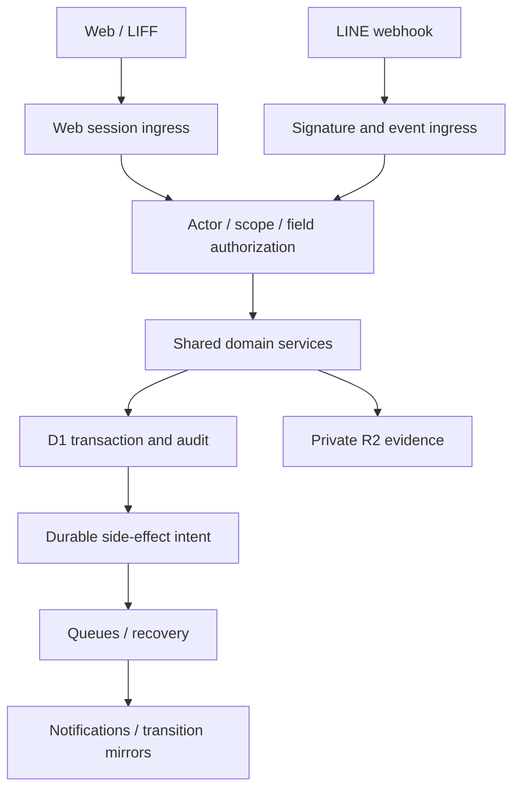

# Architecture และ ADR

## ADR-01 — reuse backend, separate presentation

เสนอ TypeScript responsive frontend package แยกใน repo เดิม (React/Vite เป็น default proposal ต้องตรวจ dependency compatibility ตอน W02) และ backend web ingress ใหม่ที่เรียก services เดิม. ไม่ให้ browser เขียน D1/Sheets หรือใช้ developer admin endpoints โดยตรง. Hosting target เสนอแยก static surface แต่ same-origin API ผ่าน controlled routing; exact domain/bindings เป็น release configuration ไม่กำหนด Production ค่าใหม่ในรอบนี้

## ADR-02 — data and computation

- Reuse canonical identity, attendance, wage, payroll, expense and personal ledger. Add stock/recipe/planning entities หลัง source mapping; ไม่แบ่ง DB ตามสามไฟล์
- D1 read models/report projections สร้างใหม่ได้จาก authoritative records; ไม่ถือ Sheets formula outputs เป็น authoritative opening ledger โดยอัตโนมัติ
- D1 batch/conditional statements/constraints ออกแบบ atomic transitions ตามความสามารถจริงของ D1; Sessions API ช่วย read consistency ไม่ใช่ distributed transaction lock. W02/W03 ต้องพิสูจน์ CAS checks ทั้ง path และ concurrency ด้วย synthetic D1 tests. [D1 API](https://developers.cloudflare.com/d1/worker-api/d1-database/)
- อย่าใช้ frontend memory lock ป้องกันเงินซ้ำ; event ordering ใช้ existing coordinator/service ตาม domain

## ADR-03 — channel-independent operation

Web supplies validated intent, authenticated actor and operation key; LINE supplies verified event identity. Domain object ID/evidence/business uniqueness ป้องกันการส่งเดียวกันจากหลายช่องทาง. Web request UUID และ LINE Message ID อย่างเดียวไม่สามารถ deduplicate ข้ามช่องทางได้

Exact-byte evidence hash เป็นสัญญาณหนึ่งเท่านั้นเพราะ LINE อาจแปลงภาพ; ใช้ validated employee/time/type/fingerprint สำหรับ attendance และ verified reference/amount/source identity สำหรับ financial duplicate detection ตาม approved policy. ใกล้เคียงแต่ไม่แน่ใจเข้า review ไม่ reject รายการจริงหรือรวมสองรายการโดยเดา

## ADR-04 — commit versus side effects

Business record + version + audit + durable side-effect intent ต้อง commit ภายใน boundary ที่ atomic จริง. Dispatch queue/notification อาจเกิดทีหลัง; recovery อ่าน durable intent และไม่ replay finalized business operation. ถ้าใช้ existing sync jobs เป็น outbox ต้องพิสูจน์ intent ไม่หายเมื่อ enqueue ล้มเหลว. Cache/UI optimistic status ห้ามรายงาน accepted ก่อน server commit

## ADR-05 — environment and observability

Local synthetic DB; TEST แยก Worker/D1/R2/queues/LINE channel/client IDs/secrets/allowlist; Production resources แยกทั้งหมด. Browser build ไม่มี Production secrets. Preview ไม่ผูก Production bindings. TEST AI disabled/mock by default; live calls เฉพาะ approved testers/data/budget หลัง authorization; ห้ามเปลี่ยน bot model จากการเลือก Codex model

Metrics แยก channel/domain/stage: accepted, rejected, unresolved, duplicate prevented, unauthorized, queue age, mirror lag, provider calls/cost. ไม่ใส่ user ID รูปหลักฐาน หมายเลขบัญชี หรือ payload ใน logs. Business health, integration degradation และ retirement mode แยกกัน แต่ห้ามลด readiness เดิมก่อน approved cutover

## ADR-06 — evidence security

Upload initiation authorize ก่อนออกสิทธิ์ส่งไฟล์; validate max size/MIME/content, owner/purpose/expiry, reject active content and unsupported type; upload grants one-purpose and short-lived. Store private R2 key server-side, no permanent public URL. R2 upload ไม่ atomic กับ D1 จึงมี pending upload lifecycle และ authorized reconciliation; ไม่ auto-delete objects จากคำสั่งวางเว็บ

Evidence reads reauthorize owning record ทุกครั้ง; short-lived links ไม่แทน permission check, cache private/no-store. Retention ใช้ approved current policy แยก doc/evidence/audit/backups; new delete worker หรือ cleanup timer ต้องแยก approval

## ADR-07 — LINE exit strategy

R1–R4 เปิดเว็บตรงและจาก LINE ได้; LINE Login ยังใช้ได้แม้เลิกกรอกในแชต. แจ้งผลที่จำเป็นมี web receipt/task inbox เป็นหลัก; optional LINE alert ไม่เป็น success dependency. R5 เปลี่ยน rich-menu link/retire text intake ตาม exact flow ที่ผ่าน UAT; ไม่เปลี่ยนลูกค้า OA/loyalty/marketing. หากจะเลิก LINE identity ด้วย ต้องทำ auth/recovery ADR ใหม่ ไม่รวมโดยปริยาย

## Engineering review entry points

src/access/authorization.ts; src/access/repository.ts; src/router/process-event.ts; src/attendance/service.ts; src/durable/attendance-coordinator.ts; src/expense/service.ts; src/personal-use/service.ts; src/payroll/repository.ts; src/sheets/sync.ts; migrations/; tests/. ชื่อ file ใหม่และ framework version ตัดสินหลัง W02 โดยไม่ broad refactor/dependency upgrade
