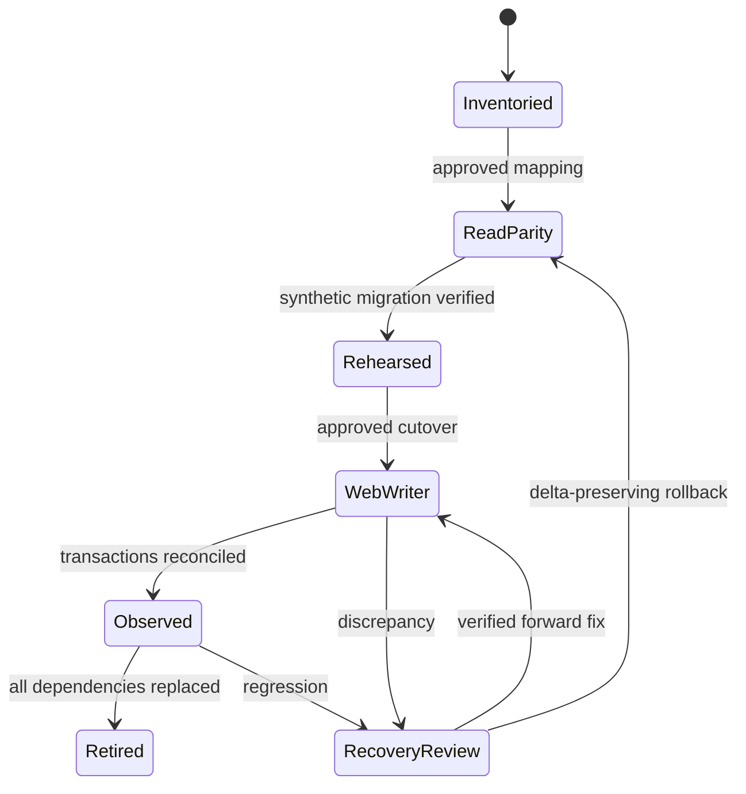

# Migration, cutover และ rollback

Migration เป็นหมวดข้อมูล ไม่ใช่เปลี่ยนทั้งสามไฟล์ในวันเดียว. ทุก phase ต้องระบุ source snapshot/cutoff, owner of writes, observed lag, rollback and acceptance. Backup/data extraction จริงไม่อยู่ใน authority ของการจัดทำแผนนี้

## Module migration state machine

## Writer ownership by domain

| Domain | ก่อน cutover | ระหว่าง parity | หลัง cutover |
|---|---|---|---|
| Core attendance/expense/personal/payroll | existing domain service→D1 | LINE and web adapters use same service; selected live channel by rollout config | shared service→D1; LINE intake later retired by flow |
| Stock/recipe/production inputs | verified source Sheets writer | web read-only/synthetic TEST write; no second live ledger | web service writes, Sheets readonly mirror/archive |
| Staff/shift config | existing import/HR path ตาม current inventory | read comparisons only | web config commands; legacy importer fenced for migrated scope |
| Accounting reports | approved current records+sheet formulas | independent computed comparison, no replacement totals posted | database reports using approved formula/policy parity |

“หนึ่ง writer” หมายถึงหนึ่ง authoritative business service ต่อข้อมูล ไม่จำเป็นต้องหนึ่งหน้าจอ. ทุก old importer/trigger ต้องมี fencing/epoch หรือ explicit disabled-scope behavior ที่ทดสอบแล้ว; ห้ามให้แถวเก่าถูก import ทับ web version หลัง cutover

## Rehearsal and import procedure

1. W01 classify every source row/range and sensitivity; freeze approved mapping version
2. Create authorized private snapshot with capture time/timezone/checksum and readable restore; multi-sheet capture ต้องมี cutoff/change-log reconciliation ไม่อ้าง atomic snapshot ถ้าไม่มี
3. Build synthetic representative fixtures for code tests; real snapshots never committed to GitHub
4. Dry-run import produces intended creates/links/quarantines/exclusions and source-to-target counts. IDs deterministic by batch/source identity; row numbers alone not identity
5. Classify existing D1 record vs new domain record; do not import core Attendance/Payroll/Expense mirrors as new business events
6. Apply to isolated authorized TEST restored/synthetic data; run twice, compare record counts/hash/totals, integrity/FK and relationships
7. Verify old-reader/new-schema and rollback compatibility; additive migration does not guarantee semantic compatibility
8. Reconcile all scoped records and aggregates by businessDate/item/employee/period (private detail); retain source lineage and exception decisions

## Required checks before module cutover

- All mapping rows reviewed; unresolved money/identity/quantity conflict = NO-GO for affected module
- #58 implementation prerequisite satisfied plus task/rollout authorization; no use of expired or unrelated release path
- Exact environment, source and target versions, secret scope, rollout allowlist, schema ordering, known-good rollback build identified
- Backup+download checksum+restore/integrity/FK proof; limits/restore duration measured
- Freeze affected old writer or establish delta log/cutoff; drain in-flight writes and classify queued actions, drafts, unconfirmed expenses, pending corrections
- Import/enable web writer; revoke only approved write permissions/import pathways for migrated scope
- Reconcile **all** in-scope IDs and totals, not just sample happy paths; sample UI checks supplement full ledger reconciliation
- Announce work instructions only through separately authorized staff communication; this planning task sends none

## Observation and acceptance

Proposed MPW minimum: 7 consecutive operating days of staff flows including weekday/weekend patterns, one complete approved payroll cycle, one purchase/partial-receipt cycle, and an actual accounting period close for financial retirement. Extend when a required flow did not occur. These are proposed new-module rollout minima; they never shorten existing #58 seven/fourteen-day gates or replace their evidence

Per day/flow evidence records: attempted/accepted/rejected/pending/duplicate-prevented, lost=0 unexplained, duplicate-finalized=0, projection completeness, unresolved variance, operator/version, incident/recovery. An HTTP 200 or empty queue alone is insufficient

## Rollback after new writes

Stop affected new intake, preserve D1/R2 and operation receipts, drain/classify in-flight operations, capture private delta since cutoff, choose tested compatible old build or forward-fix. If reverting writer to Sheets, first project verified delta into approved input areas, reconcile and fence web writes; never restore an old DB backup over newer valid transactions. If safe reverse projection does not exist, remain in controlled read-only recovery and execute approved forward-fix instead of promising instant rollback

## Final Sheets / LINE retirement

W16 dependency proof covers: HR config imports, shift imports, daily accounting formulas/layout, stock/recipe/unit lookups, month-close calculations, readiness/bootstrap, cron/recovery/reconcile, mirror queue producers/consumers, export/report links, Drive ACLs, LINE commands/rich menus/notifications, legacy app dependencies. Operational Sheets withdrawal and Legacy Apps Script removal are separate gates

`SHEETS_SYNC_ENABLED=false` is not a lossless pause and does not remove all reads/readiness dependencies according to existing inventory. Retirement needs explicit writer/readiness redesign, durable delta/backfill plan and exact configuration approval. Do not disable it as a shortcut

Keep required historical data accessible through approved private archive/web report with provenance; user no longer needs Sheets to calculate or enter data. Permanent deletion, retention changes and credential revocation each require exact authorized scope after dependency proof. Customer-facing LINE OA stays outside this retirement
